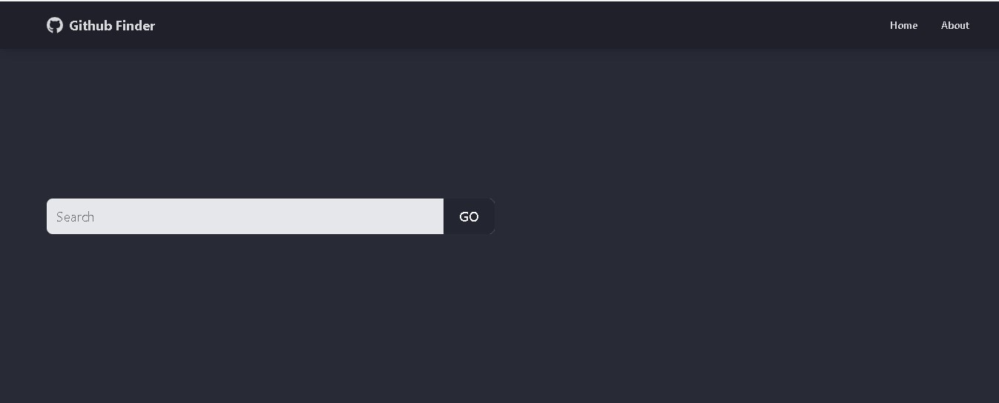
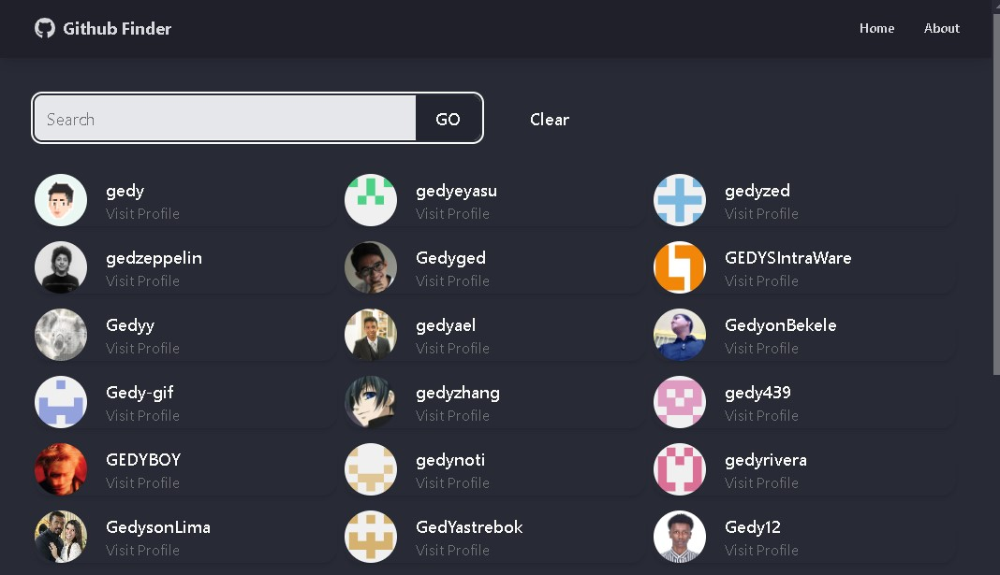

# GitHub Finder

A modern React application that allows you to search for GitHub users and view their profiles, repositories, and statistics. Built with React 19, Vite, and TailwindCSS.



## ✨ Features

- 🔍 Search for GitHub users by username
- 👤 View detailed user profiles including bio, location, and social links
- 📊 Display user statistics (followers, following, public repos, gists)
- 📁 Browse user's latest repositories with sorting options
- 🎨 Modern UI with DaisyUI components and Tailwind CSS
- 🌙 Dark theme support (Dracula theme)
- ⚡ Fast and responsive with Vite
- 🔄 Loading states and error handling
- 📱 Fully responsive design

## 🛠️ Tech Stack

- **Frontend Framework:** React 19
- **Build Tool:** Vite
- **Styling:** TailwindCSS 4 + DaisyUI
- **Routing:** React Router DOM v7
- **Icons:** React Icons
- **State Management:** React Context API with useReducer
- **API:** GitHub REST API v3
- **HTTP Client:** Fetch API

## 📦 Prerequisites

Before you begin, ensure you have the following installed:
- Node.js (v16 or higher)
- npm or yarn
- A GitHub Personal Access Token ([Create one here](https://github.com/settings/tokens))

## 🚀 Getting Started

### 1. Clone the repository

```bash
git clone https://github.com/gedyzed/github-finder.git
cd github-finder
```

### 2. Install dependencies

```bash
npm install
```

### 3. Set up environment variables

Create a `.env` file in the root directory:

```bash
cp .env.example .env
```

Edit the `.env` file and add your GitHub Personal Access Token:

```env
VITE_GITHUB_API="https://api.github.com"
VITE_GITHUB_TOKEN="your_github_personal_access_token_here"
```

**Note:** To create a GitHub Personal Access Token:
1. Go to [GitHub Settings > Developer settings > Personal access tokens](https://github.com/settings/tokens)
2. Click "Generate new token (classic)"
3. Give it a descriptive name and select the necessary scopes (public_repo access is sufficient)
4. Copy the token and paste it in your `.env` file

### 4. Start the development server

```bash
npm run dev
```

The application will open at `http://localhost:5173`

## 📜 Available Scripts

In the project directory, you can run:

- `npm run dev` - Starts the development server
- `npm run build` - Builds the app for production
- `npm run preview` - Preview the production build locally
- `npm run lint` - Run ESLint to check code quality

## 📸 Screenshots

### Home Page


### Search Results


### User Profile


## 🏗️ Project Structure

```
github-finder/
├── public/              # Public assets
├── src/
│   ├── assets/         # Images and static files
│   ├── component/      # React components
│   │   ├── layout/     # Layout components (NavBar, Footer)
│   │   └── users/      # User-related components
│   ├── context/        # Context API state management
│   │   ├── Github/     # GitHub data context
│   │   └── alert/      # Alert notifications context
│   ├── pages/          # Page components
│   │   ├── Home.jsx
│   │   ├── About.jsx
│   │   ├── User.jsx
│   │   └── NotFound.jsx
│   ├── App.jsx         # Main App component
│   └── main.jsx        # Entry point
├── .env.example        # Environment variables template
├── index.html          # HTML template
├── package.json        # Dependencies and scripts
└── vite.config.js      # Vite configuration
```

## 🤝 Contributing

Contributions are welcome! Please feel free to submit a Pull Request.

1. Fork the project
2. Create your feature branch (`git checkout -b feature/AmazingFeature`)
3. Commit your changes (`git commit -m 'Add some AmazingFeature'`)
4. Push to the branch (`git push origin feature/AmazingFeature`)
5. Open a Pull Request

## 📝 License

This project is open source and available under the MIT License.

## 👤 Author

**gedyzed**

- GitHub: [@gedyzed](https://github.com/gedyzed)

## 🙏 Acknowledgments

- GitHub API for providing the data
- React and Vite teams for amazing tools
- TailwindCSS and DaisyUI for beautiful styling components

---

⭐ If you find this project useful, please consider giving it a star on GitHub!
